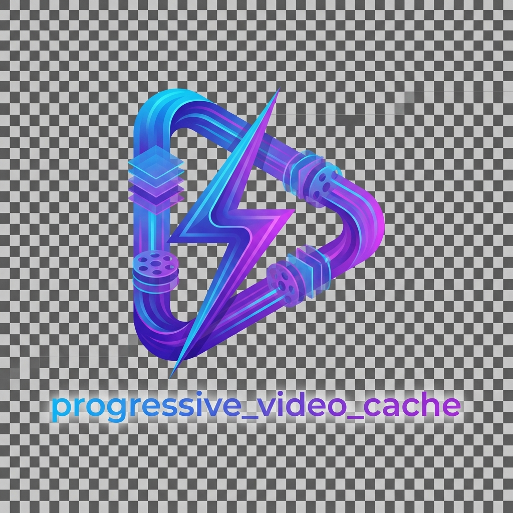

<div align="center">



# Progressive Video Cache

[](https://pub.dev/packages/progressive_video_cache)
[](https://opensource.org/licenses/MIT)

**The ultimate caching solution for TikTok-style scrolling apps.**

</div>

---

**progressive_video_cache** is a high-performance video caching library designed specifically for Flutter apps that need instant playback, offline support, and smart network management. 

It handles both standard **MP4** files and complex **HLS (.m3u8)** streams with adaptive prefetching, making it perfect for Reels, Shorts, and Feed-based video applications.

## ✨ Features

- ⚡ **Instant Playback**: Stream while downloading (progressive caching).
- 🎬 **HLS & MP4 Support**: Seamlessly handles both formats with a unified API.
- 🧠 **Smart Prefetching**: Automatically prefetches upcoming videos in your feed based on scroll direction.
- 📡 **Network Aware**: Adapts download strategies based on real-time network quality (WiFi, 4G, 5G, Slow).
- 💾 **Offline First**: Cached content plays instantly without an internet connection.
- 🔄 **Resumable Downloads**: Downloads pick up exactly where they left off.
- 📦 **Zero Config**: Works out of the box with reasonable defaults.

## 🚀 Installation

Add this to your `pubspec.yaml`:

```yaml
dependencies:
  progressive_video_cache: ^1.0.0
```

## 🛠 Usage

### 1. Basic Playback
Get a file path that is ready to play. The package handles downloading and caching internally.

```dart
import 'dart:io';
import 'package:progressive_video_cache/progressive_video_cache.dart';
import 'package:video_player/video_player.dart';

// Initialize the controller
final prefetch = ReelPrefetchController();

// Get the local path (downloads automatically if needed)
final path = await prefetch.getPlayablePath('https://example.com/video.m3u8');

// Play using the standard VideoPlayerController
final controller = VideoPlayerController.file(File(path));
await controller.initialize();
controller.play();
```

### 2. Smart Feed Prefetching
Integrate with your PageView or ListView to automatically prefetch videos before they appear on screen.

```dart
// In your PageView.onPageChanged or ScrollController listener
prefetch.onScrollUpdate(
  urls: videoUrlsList,  // List of all video URLs in the feed
  currentIndex: index,  // Current visible index
);
```

### 3. Network Quality Monitoring
The package includes a singleton to monitor network conditions and optimize bandwidth usage.

```dart
final monitor = NetworkQualityMonitor.instance;

// Get current network type info
print('Network speed: ${monitor.estimatedBandwidth} KB/s');
print('Network type: ${monitor.currentType}'); // NetworkType.wifi, .fourG, etc.
```

## 🏗 Architecture

**progressive_video_cache** uses a unique file-based approach rather than a local proxy:

- **MP4**: Downloads directly to a growing local file which the video player reads simultaneously.
- **HLS**: Downloads the master playlist, parses media playlists, and progressively downloads TS segments to local storage, creating a local playback manifest.

This architecture ensures high stability and eliminates common proxy-server issues like socket disconnects.

## 🤝 Contributing

Contributions are welcome! Please feel free to submit a Pull Request.

## 📄 License

This project is licensed under the MIT License - see the LICENSE file for details.
